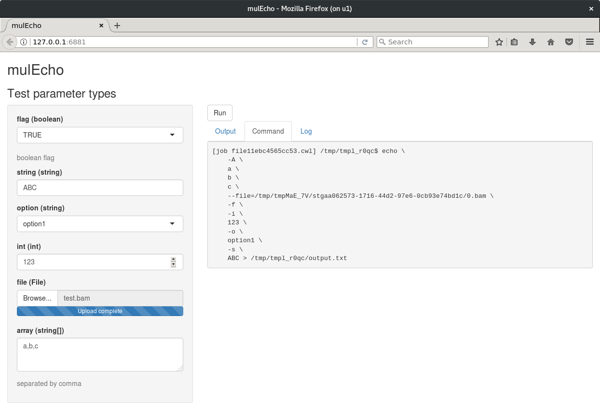

--- 
title: "Bioinformatics tools and pipelines using R and CWL"
author: "Qiang Hu"
date: "`r Sys.Date()`"
site: bookdown::bookdown_site
output: 
  word_document:
    always_allow_html: yes
documentclass: book
bibliography: [book.bib, packages.bib]
biblio-style: apalike
link-citations: yes
github-repo: rstudio/bookdown-demo
description: "A manual to wrap Bioinformatics tools and pipelines with Common Workflow Language using the Rcwl package."
---

# Preface {-}

This short book introduces the R packages, **Rcwl** and **RcwlPipelines**, to improve your way to build, manage and run a Bioinformatics tools and pipeline. 

The **Rcwl** package is built on top of the Common Workflow Language (CWL), and it provides a simple and user-friendly way to wrap command line tools and build data analysis pipelines in R using CWL. The **RcwlPipelines** package is a collection of Bioinformatics tool and pipeline recipes based on **Rcwl**.

## R package installation

The **Rcwl** and **RcwlPipelines** packages can be installed from Bioconductor or Github:

```{r eval=FALSE}
BiocManager::install(c("Rcwl", "RcwlPipelines"))
# or the development version
BiocManager::install(c("hubentu/Rcwl", "hubentu/RcwlPipelines"))
```

Load the packages into R session.
```{r}
library(Rcwl)
library(RcwlPipelines)
```

## System requirements

Besides the depedencies of the R packages, the following tools are required to be installed to run the examples in this book.

* python (>= 2.7)
* cwltool (>= 1.0.2018)
* nodejs

The **cwltool** is the reference implementation of the Common Workflow Language, which is used to run the CWL scripts. The **nodejs** is required when the CWL scripts used JavaScript. Here you can find instruction to install these tools.

* <https://github.com/common-workflow-language/cwltool#install>
* <https://nodejs.org>

## Docker

The Docker containers simplify software installation and management. Especially for bioinformatics tools, such toolos often require different runtime environments and library dependcies. For the build workflow, the software required for the installation itself is a big challenge. A CWL runner can perform this work automatically by pulling the Docker containers and adjusting the paths of input files. However, the Docker requirements are optional. CWL scripts can also be run locally with all the dependencies installed.

## Structure of the book

* Introduction
* Components
* Build CWL workflows
* Run approaches
* Case study

## R session information

The R session information when compiling this mannual is shown below:

```{r}
sessionInfo()
```

<!--chapter:end:index.Rmd-->

\mainmatter

# Introduction {#intro}

- Gap between BioInfo and BioC
  + Heavy BioInfo tools and Pipelines beyond BioC

- Tools to build pipelines and generate reproducible reports are required 
  + Standardization BioInfo Pipelines for best practice
  + Portable pipelines
  + Reproducible analysis and report
  + Easy to use in different platforms

## Common Workflow Language
"The Common Workflow Language (CWL) is a specification for describing
analysis workflows and tools in a way that makes them portable and
scalable across a variety of software and hardware environments, from
workstations to **cluster, cloud, and high performance computing (HPC)**
environments."

<https://www.commonwl.org/>

- To wrap tool and workflows parameters in a standard format

- Capable of invoking tools from Docker containers

- Used by Broad Institute, TCGA, Galaxy Project, DNAnexus...

## First example
The main class and constructor function is `cwlParam`, which wrap a command line tool and its parameters in a `cwlParam` object. Let's start with a simple example, `echo hello world`.

First, we load the package and then define the input parameter for "echo", a string without a prefix. Just an `id` option required.
```{r}
input1 <- InputParam(id = "sth")
```

Second, create a `cwlParam` object with `baseCommand` for the command to execute and `InputParamList` for the input parameters.
```{r}
echo <- cwlParam(baseCommand = "echo", inputs = InputParamList(input1))
```

Now we have a command object to run. Let's send a string "Hello World!" to the object. Without defining the outputs, it will stream standard output to a temporary file by default.
```{r}
echo$sth <- "Hello World!"
echo
```

## Test run
The function `runCWL` is used to run the CWL object by invoking the python tool `cwltool`. The return will be a list including the command executed, temporary output and logs. The output directory is the current folder by default, but it can be changed by setting `outdir` option. All standard out and standard error stream can also be printed by setting `stderr = ""`.
```{r}
r1 <- runCWL(echo, outdir = tempdir())
r1
```

Here we can check the output to ensure the code did what we expected.
```{r}
r1$output
readLines(r1$output)
```

The executed command was returned in the result list. It shows the command that we defined to run.
```{r}
r1$command
```

The log shows the details of how the `cwltool` works with CWL scripts.
```{r}
r1$log
```
The `runCWL` generated two scripts with the default `tempfile` prefix, the tool wrapper CWL file and the input YML file. The `cwltool` parse the two scripts and translate them to the command shown before. The output is not defined in the `cwlParam` object, so the command output was returned to __stdout__ by default.

<!--chapter:end:01-intro.Rmd-->

# Components
## Input Parameters
### Essential Input parameters
For the input parameters, three options need to be defined usually, *id*, *type*, and *prefix*. The type can be *string*, *int*, *long*, *float*, *double*, and so on. More detail can be found at: <https://www.commonwl.org/v1.0/CommandLineTool.html#CWLType>.

Here is an example from [CWL user guide](http://www.commonwl.org/user_guide/03-input/). Here we defined an `echo` with different type of input parameters by `InputParam`. The `stdout` option can be used to caputre the standard output stream to a file.

```{r}
e1 <- InputParam(id = "flag", type = "boolean", prefix = "-f")
e2 <- InputParam(id = "string", type = "string", prefix = "-s")
e3 <- InputParam(id = "int", type = "int", prefix = "-i")
e4 <- InputParam(id = "file", type = "File", prefix = "--file=", separate = FALSE)
echoA <- cwlParam(baseCommand = "echo",
                  inputs = InputParamList(e1, e2, e3, e4),
                  stdout = "output.txt")
```

Then we give it a try by setting values for the inputs.
```{r}
echoA$flag <- TRUE
echoA$string <- "Hello"
echoA$int <- 1

tmpfile <- tempfile()
write("World", tmpfile)
echoA$file <- tmpfile

r2 <- runCWL(echoA, outdir = tempdir())
r2$command
```

### Array Inputs
A similar example to CWL user guide. We can define three different type of array as inputs. 
```{r}
a1 <- InputParam(id = "A", type = "string[]", prefix = "-A")
a2 <- InputParam(id = "B",
                 type = InputArrayParam(items = "string",
                                        prefix="-B=", separate = FALSE))
a3 <- InputParam(id = "C", type = "string[]", prefix = "-C=",
                 itemSeparator = ",", separate = FALSE)
echoB <- cwlParam(baseCommand = "echo",
                 inputs = InputParamList(a1, a2, a3))
```

Then set values for the three inputs.
```{r}
echoB$A <- letters[1:3]
echoB$B <- letters[4:6]
echoB$C <- letters[7:9]
echoB
```

Now we can check whether the command behaves as we expected.
```{r}
r3 <- runCWL(echoB, outdir = tempdir())
r3$command
```

## Output Parameters
### Capturing Output
The outputs, similar to the inputs, is a list of output parameters. Three options *id*, *type* and *glob* can be defined. The glob option is used to define a pattern to find files relative to the output directory.

Here is an example to unzip a compressed `gz` file. First, we generate a compressed R script file.
```{r}
zzfil <- file.path(tempdir(), "sample.R.gz")
zz <- gzfile(zzfil, "w")
cat("sample(1:10, 5)", file = zz, sep = "\n")
close(zz)
```

We define a `cwlParam` object to use "gzip" to uncompress a input file.
```{r}
ofile <- "sample.R"
z1 <- InputParam(id = "uncomp", type = "boolean", prefix = "-d")
z2 <- InputParam(id = "out", type = "boolean", prefix = "-c")
z3 <- InputParam(id = "zfile", type = "File")
o1 <- OutputParam(id = "rfile", type = "File", glob = ofile)
gz <- cwlParam(baseCommand = "gzip",
               inputs = InputParamList(z1, z2, z3),
               outputs = OutputParamList(o1),
               stdout = ofile)
```

Now the `gz` object can be used to uncompress the previous generated compressed file.
```{r}
gz$uncomp <- TRUE
gz$out <- TRUE
gz$zfile <- zzfil
r4 <- runCWL(gz, outdir = tempdir())
r4$output
```

Or we can use `arguments` to set some default parameters.
```{r}
z1 <- InputParam(id = "zfile", type = "File")
o1 <- OutputParam(id = "rfile", type = "File", glob = ofile)
Gz <- cwlParam(baseCommand = "gzip",
               arguments = list("-d", "-c"),
               inputs = InputParamList(z1),
               outputs = OutputParamList(o1),
               stdout = ofile)
Gz
Gz$zfile <- zzfil
r4a <- runCWL(Gz, outdir = tempdir())
```

To make it for general usage, we can define a pattern with javascript to glob the output, which require `node` to be installed in your system PATH.
```{r}
pfile <- "$(inputs.zfile.path.split('/').slice(-1)[0].split('.').slice(0,-1).join('.'))"
```

Or we can use the CWL built in file property, `nameroot`, directly.
```{r}
pfile <- "$(inputs.zfile.nameroot)"
o2 <- OutputParam(id = "rfile", type = "File", glob = pfile)
req1 <- list(class = "InlineJavascriptRequirement")
GZ <- cwlParam(baseCommand = c("gzip", "-d", "-c"),
               requirements = list(), ## assign list(req1) if node installed.
               inputs = InputParamList(z1),
               outputs = OutputParamList(o2),
               stdout = pfile)
GZ$zfile <- zzfil
r4b <- runCWL(GZ, outdir = tempdir())
```

### Array Outputs

We can also capture multiple output files with `glob` pattern.
```{r}
a <- InputParam(id = "a", type = InputArrayParam(items = "string"))
b <- OutputParam(id = "b", type = OutputArrayParam(items = "File"), glob = "*.txt")
touch <- cwlParam(baseCommand = "touch", inputs = InputParamList(a), outputs = OutputParamList(b))
touch$a <- c("a.txt", "b.gz", "c.txt")
r5 <- runCWL(touch, outdir = tempdir())
r5$output
```

<!--chapter:end:02-Components.Rmd-->

# Writing Pipeline
We can connect multiple tools together into a pipeline. Here is an example to uncompress an R script and execute it with `Rscript`.

Here we define a simple `Rscript` tool without using docker.
```{r}
d1 <- InputParam(id = "rfile", type = "File")
Rs <- cwlParam(baseCommand = "/usr/bin/Rscript",
               inputs = InputParamList(d1))
Rs
```

Test run:
```{r}
Rs$rfile <- r4$output
tres <- runCWL(Rs, outdir = tempdir())
readLines(tres$output)
```

The pipeline includes two steps, decompressed by `GZ` and compiled by `Rs`. The input file is a compressed file and the output would be the output `Rout` from `Rs`.

First we need to define the direct inputs and outputs from `GZ` and `Rs`.
```{r}
i1 <- InputParam(id = "cwl_zfile", type = "File")
o1 <- OutputParam(id = "cwl_cout", type = "File", outputSource = "Compile/output")
```
For the input cwl_zifle, it refers to the `GZ` input `zfile`.  The output "cwl_cout" will be the outcome of `Rs` output `Rout`.

The pipeline contains two steps, "Uncomp" to uncompress file with `GZ` and "Compile" to run script with `Rs`. First, we use `cwlStepParam` to define `inputs` and `outputs` from previous step. Then it connects with the two steps with `Step` function. The `run` option refer to the corresponding `cwlParam` object and the `In` option in steps should be linked to the input parameters defined by `cwlStepParam`. In the end, we use `+` to connect all steps.
```{r}
cwl <- cwlStepParam(inputs = InputParamList(i1),
                    outputs = OutputParamList(o1))
s1 <- Step(id = "Uncomp", run = GZ,
           In = list(zfile = "cwl_zfile"))
s2 <- Step(id = "Compile", run = Rs,
           In = list(rfile = "Uncomp/rfile"))
cwl <- cwl + s1 + s2
cwl
```

Let's run the pipeline.
```{r}
cwl$cwl_zfile <- zzfil
r7 <- runCWL(cwl, outdir = tempdir())
readLines(r7$output)
```

## Scattering pipeline
The scattering feature can specifies the associated workflow step or subworkflow to execute separately over a list of input elements. To use this feature, `ScatterFeatureRequirement` must be specified in the workflow requirements. Different `scatter` methods can be used in the associated step to decompose the input into a discrete set of jobs. More details can be found at: https://www.commonwl.org/v1.0/Workflow.html#WorkflowStep.

Here is an example to execute multiple R scripts. First, we need to set the input and output types to be array of "File", and add the requirments. In the "Compile" step, the scattering input is required to be set with the `scatter` option.
```{r}
i2 <- InputParam(id = "cwl_rfiles", type = "File[]")
o2 <- OutputParam(id = "cwl_couts", type = "File[]", outputSource = "Compile/output")
req1 <- list(class = "ScatterFeatureRequirement")

cwl2 <- cwlStepParam(requirements = list(req1),
                     inputs = InputParamList(i2),
                     outputs = OutputParamList(o2))
s1 <- Step(id = "Compile", run = Rs,
           In = list(rfile = "cwl_rfiles"),
           scatter = "rfile")
cwl2 <- cwl2 + s1
cwl2
```

Multiple R scripts can be assigned to the workflow inputs and executed.
```{r}
cwl2$cwl_rfiles <- c(r4b$output, r4b$output)
r8 <- runCWL(cwl2, outdir = tempdir())
r8$output
```

## Pipeline plot
The function `plotCWL` can be used to visualize the relationship of inputs, outputs and the analysis for a tool or pipeline.

```{r}
plotCWL(cwl)
```

<!--chapter:end:03-pipeline.Rmd-->

# Run approaches

## Running Tools in Docker
The CWL can work with docker to simplify your software management and communicate files between host and container. The docker container can be defined by the `hints` or `requirements` option.
```{r}
d1 <- InputParam(id = "rfile", type = "File")
req1 <- list(class = "DockerRequirement",
             dockerPull = "r-base")
doc <- cwlParam(baseCommand = "Rscript",
                inputs = InputParamList(d1),
                stdout = "output.txt",
                hints = list(req1))
doc$rfile <- r4$output
```
```{r, eval=FALSE}
r6 <- runCWL(doc)
```

The tools defined with docker requirements can also be run locally by disabling the docker option. In case your `Rscript` depends some local libraries to run, an option from `cwltools`, "--preserve-entire-environment", can be used to pass all environment variables.
```{r}
r6a <- runCWL(doc, docker = FALSE, outdir = tempdir(),
              Args = "--preserve-entire-environment")
```

## Running Tools in Cluster server
The CWL also can work in high performance clusters with batch-queuing system, such as SGE, PBS, SLURM and so on, using the Bioconductor package `BiocParallel`. Here is an example to submit jobs with "Multiicore" and "SGE". A more detailed example can be found (<https://hubentu.github.io/others/Rcwl_RNASeq.html>).

```{r, eval=FALSE}
library(BiocParallel)
sth.list <- as.list(LETTERS)
names(sth.list) <- LETTERS

## submit with mutlicore
result1 <- runCWLBatch(cwl = echo, outdir = tempdir(), inputList = list(sth = sth.list),
                       BPPARAM = MulticoreParam(26))

## submit with SGE
result2 <- runCWLBatch(cwl = echo, outdir = tempdir(), inputList = list(sth = sth.list),
                       BPPARAM = BatchtoolsParam(workers = 26, cluster = "sge",
                                                 resources = list(queue = "all.q")))
```

## Web Application
### cwlParam example
Here we build a tool with different types of input parameters.
```{r}
e1 <- InputParam(id = "flag", type = "boolean",
                 prefix = "-f", doc = "boolean flag")
e2 <- InputParam(id = "string", type = "string", prefix = "-s")
e3 <- InputParam(id = "option", type = "string", prefix = "-o")
e4 <- InputParam(id = "int", type = "int", prefix = "-i", default = 123)
e5 <- InputParam(id = "file", type = "File",
                 prefix = "--file=", separate = FALSE)
e6 <- InputParam(id = "array", type = "string[]", prefix = "-A",
                 doc = "separated by comma")
mulEcho <- cwlParam(baseCommand = "echo", id = "mulEcho",
                 label = "Test parameter types",
                 inputs = InputParamList(e1, e2, e3, e4, e5, e6),
                 stdout = "output.txt")
mulEcho
```

### cwlParam to Shiny App
Some input parameters can be predefined in a list, which will be converted to select options in the webapp. An `upload` parameter can be used to defined wether to generate an upload interface for the file type option. If FALSE, the upload field will be text input (file path) instead of file input.
```{r, eval=FALSE}
inputList <- list(option = c("option1", "option2"))
app <- cwlShiny(mulEcho, inputList, upload = TRUE)
runApp(app)
```


<!--chapter:end:04-Run.Rmd-->

# Application

## RcwlPipelines tools
### Rcwl scripts
The R scripts to build the CWL tools and pipelines based on the `Rcwl`
package are stored in the "tools" and "pipelines" folder respectively.
The function `cwlTools` can be used to collect the available scripts.
The `cachePath` can be your existing cache directory or a new folder.

```{r}
tools <- cwlTools(cachePath = tempdir())
tools
```

The full paths can be pulled from the "fpath" column.
```{r}
library(dplyr)
bfcinfo(tools) %>% select(rname, fpath)
```

### Build a pipeline
We can develop a pipline by utilizing the available tools. For
example, a simple alignment pipelines with mapping and marking
duplicates can be built from the `tools`.

First, we load the required tools, bwa, samtools and picard
markduplicates.

```{r}
scripts <- bfcinfo(tools) %>%
    filter(rname %in% c("bwa",
                        "samtools_samTobam",
                        "samtools_sortBam",
                        "samtools_index",
                        "markdup")) %>%
    pull(rpath)
invisible(sapply(scripts, source))
```

Next, we define the input parameters.
```{r}
p1 <- InputParam(id = "threads", type = "int")
p2 <- InputParam(id = "RG", type = "string")
p3 <- InputParam(id = "Ref", type = "string")
p4 <- InputParam(id = "FQ1", type = "File")
p5 <- InputParam(id = "FQ2", type = "File?")
```

Then we define the pipeline steps, from raw fastqs to duplicates
marked alignments.

```{r}
## bwa
s1 <- Step(id = "bwa", run = bwa,
           In = list(threads = "threads",
                     RG = "RG",
                     Ref = "Ref",
                     FQ1 = "FQ1",
                     FQ2 = "FQ2"))
## sam to bam
s2 <- Step(id = "sam2bam", run = sam2bam,
           In = list(sam = "bwa/sam"))
## sort bam
s3 <- Step(id = "sortBam", run = sortBam,
           In = list(bam = "sam2bam/bam"))
## mark duplicates
s4 <- Step(id = "markdup", run = markdup,
           In = list(ibam = "sortBam/sbam",
                     obam = list(
                         valueFrom="$(inputs.ibam.nameroot).mdup.bam"),
                     matrix = list(
                         valueFrom="$(inputs.ibam.nameroot).markdup.txt")))
## index bam
s5 <- Step(id = "idxBam", run = samtools_index,
           In = list(bam = "markdup/mBam"))
```

Last, we define the outputs and connect the steps to a new pipeline.
```{r}
req1 <- list(class = "StepInputExpressionRequirement")
req2 <- list(class = "InlineJavascriptRequirement")
## outputs
o1 <- OutputParam(id = "Bam", type = "File", outputSource = "markdup/mBam")
o2 <- OutputParam(id = "Idx", type = "File", outputSource = "idxBam/idx")
## stepParam
Align <- cwlStepParam(requirements = list(req1, req2),
                      inputs = InputParamList(p1, p2, p3, p4, p5),
                      outputs = OutputParamList(o1, o2))
## build pipeline
Align <- Align + s1 + s2 + s3 + s4 + s5
```

The pipeline is ready for use. We can plot the pipeline with
`plotCWL` from the `Rcwl` package.
```{r}
plotCWL(Align)
```

## RcwlPipelines summary
There are mainly 4 pipelines are collected in this package. Here is a
breif introduction to these pipelines. More pipelines and tools are
expected to be included in the future.

## DNASeq alignment pipeline
The pipeline can be used to preprocess DNA sequences in fastq
format. It can take paired fastqs, read groups from multiple batches
as input.

```{r}
data(alignMerge)
inputs(alignMerge)
```

The pipeline includes two steps and several jobs will be run in each
step.

1. ``r names(runs(alignMerge))[[1]]``: bwa alignment by read groups.
```{r}
runs(runs(alignMerge)[[1]])
```
	
   * `bwa`: To align fastqs and read groups to reference genome with `bwa`.
   * `sam2bam`: To convert the alignments in "sam" format to "bam"
     format with `samtools`.
   * `sortBam`: To sort the "bam" file by coordinates with `samtools`.
   * `idxBam`: To index "bam" file with `samtools`.
  
2. ``r names(runs(alignMerge))[[2]]``: Merge by samples and markduplicates.
```{r}
runs(runs(alignMerge)[[2]])
```

   * `mergeBam`: To merge bam files from multiple batches with `picard`.
   * `markdup`: To mark duplicates with `picard`.
   * `samtools_index`: To index bam file with `samtools`.
   * `samtools_flagstat`: To summarize flags in bam with `samtools`.

The final bam files after duplicates marked, bam index, duplicates
matrix, and flag statistics summary will be in the output folder.

```{r}
outputs(alignMerge)
```

Here is the short summary and steps plot.
```{r}
short(alignMerge)
plotCWL(alignMerge)
```

### Prepara data
Here is an example of two samples. The "sample1" have two lanes of sequences and the "sample2" only has one pair of reads. The lists of reads1 `fq1`, reads2 `fq2`, read groups and output BAM names are defined in the `inputList`. The reference genome and number of threads to run the job are defined in the shared options, `paramList`.

```{r, eval=FALSE}
fq1 <- list(sample1 = list("apps/DNASeq/data/fq1_1.fq",
                           "apps/DNASeq/data/fq2_1.fq"),
            sample2 = list("apps/DNASeq/data/fq1_1.fq"))
fq2 <- list(sample1 = list("apps/DNASeq/data/fq1_2.fq",
                           "apps/DNASeq/data/fq2_2.fq"),
            sample2 = list("apps/DNASeq/data/fq1_2.fq"))
rgs <- list(sample1 = list("@RG\\tID:sample1.1\\tSM:sample1",
                           "@RG\\tID:sample1.2\\tSM:sample1"),
            sample2 = list("@RG\\tID:sample2.1\\tSM:sample2"))
samples <- list(sample1 = "sample1.bam", sample2 = "sample2.bam")

inputList <- list(idBam = samples, RG= rgs, FQ1s = fq1, FQ2s = fq2) 
paramList <- list(threads = 2,
                  Ref = "apps/data/hs37d5.fa")
```

### Run in cluster
```{r, eval=FALSE}
res <- runCWLBatch(alignMerge, outdir = "output/BAM",
                   inputList = inputList, paramList = paramList,
                   BPPARAM = BatchtoolsParam(workers = 2, cluster = "sge",
                                             template = "apps/data/sge.tmpl",
                                             resources = list(jobname="bwa",
                                                              threads = 2,
                                                              queue = "all.q")))
```

List outputs:
```{r}
dir("apps/DNASeq/output/BAM/sample1")
```

## RNASeq pipeline
The pipeline was built with reads quality summary, `STAR` alignment,
quantification by `featureCounts` and `RSeQC` quality control. Here
are the inputs.

```{r}
data(rnaseq_Sf)
inputs(rnaseq_Sf)
```

The pipeline includes 6 steps.

* `fastqc`: To run quality summary for raw fastqs with `fastqc`.
* `STAR`: To align fastqs with `STAR`.
* `samtools_index`: To index aligned bam file.
* `samtools_flagstat`: To summary alignment flags.
* `featureCounts`: To quantify gene abundances.
* `RSeQC`: Several steps included.\
	- `gtfToGenePred`: To convert GTF annotation to "genePred" format.
	- `genePredToBed`: To convert "genePred" annotation to "bed" format.
	- `r_distribution`: To run reads distribution over genome features.
	- `gCoverage`: To summarize read coverage over gene body.

The outputs and logs from alignment, quantification and QC steps are
collected together to the output folder. A final QC report could be
generated by `multiqc`, which is also available in the data package.

Here are the short summary and steps plot.
```{r}
short(rnaseq_Sf)
plotCWL(rnaseq_Sf)
```

### Prepare data
An RNASeq test data set can be downloaded from [genomedata](http://genomedata.org/rnaseq-tutorial/HBR_UHR_ERCC_ds_5pc.tar), which includes pair-end fastqs for 6 samples.
```{r, eval=FALSE}
download.file("http://genomedata.org/rnaseq-tutorial/HBR_UHR_ERCC_ds_5pc.tar", "apps/RNASeq/data/HBR_UHR_ERCC_ds_5pc.tar)
untar("apps/RNASeq/data/HBR_UHR_ERCC_ds_5pc.tar", exdir = "apps/RNASeq/data/")
```

The input data must be in a named list, with the same names as the input list of the pipeline. For this pipeline, 5 inputs are required to be set, including `in_seqfiles`, `in_prefix`, `in_genomeDir`, `in_GTFfile` and `in_runThreadN`.

There are two different input lists, `inputList` and `paramList`. The `inputList` is used to define the inputs for each sample and will be submitted to different cluster nodes. The `paramList` is used to define parameters which are shared in all jobs.

Two following inputs should be listed in `inputList`.

* `in_seqfiles`: A list with the fastq files of each sample in each element. The names of the list are also required to be defined and can be the sample IDs. The length of the list will be the same as the number of samples, thus the list will be defined to `inputList` and assigned to different nodes for parallel computing.

* `in_prefix` The same as `in_seqfiles`, which define a list of sample IDs.

```{r}
files <- normalizePath(list.files("apps/RNASeq/data/", ".gz", full.names = TRUE))
files <- tapply(files, substring(basename(files), 1, 8), as.list)
inputList <- list(in_seqfiles = files,
                  in_prefix = as.list(names(files)))
```

These 3 parameter will be defined in `paramList`.

* `in_genomeDir`: The reference genome indexes for STAR.

* `in_GTFfile`: The gene annotation file in GTF format.

* `in_runThreadN`: The number of threads to run for each job.

```{r}
paramList <- list(
    in_genomeDir = "apps/data/GRCh38_100/",
    in_GTFfile = "apps/data/gencode.v25.annotation.gtf",
    in_runThreadN = 4
)
```

In some case, we need to modify the default arguments in some steps of a pipeline. For example,
```{r}
arguments(rnaseq_Sf, "STAR")[[2]] <- "2"
head(arguments(rnaseq_Sf, "STAR"))
```

### Submit pipeline with SGE
The function `runCWLBatch` is used to submit the pipeline to cluster server. In addition to defining `inputList` and `paramList`, we need to define parallel parameters from the `BiocParallel` package. Here, we use "sge" to submit the jobs. The "sge" template is a bash script with some predefined parameters for "qsub". The nodes queue name and number of slots/threads are variables from the template and can be assigned by the `resources` list. 

```{r, eval=FALSE}
res <- runCWLBatch(cwl = rnaseq_Sf, outdir = "apps/RNASeq/output/",
                   inputList = inputList, paramList = paramList,
                   BPPARAM = BatchtoolsParam(
                       workers = lengths(inputList)[1], cluster = "sge",
                       template = "apps/data/sge_centos7.tmpl",
                       resources = list(queue = "centos7.q",
                                        threads = 4)))
```

That's it! The fastqc files of each sample will be submitted to different nodes to run the whole pipeline automatically.

All the results have been collected to output directory of each sample. For example,
```{r}
dir("apps/RNASeq/output/HBR_Rep1")
```

### Summarize QC
The tool "multiqc" can aggregate results from the multiple outputs of the pipeline and generate a single page report, which also was implemented in the `RcwlPipelines` package.

We can also run the tool using `Rcwl` locally with option `docker = TRUE`.
```{r, eval=FALSE}
data(multiqc)
multiqc$dir <- "apps/RNASeq/output"
multiqc
```

```{r, eval=FALSE}
runCWL(multiqc, stderr = "", Args = "--preserve-entire-environment", docker = FALSE)
```

**Here we got the QC report:**

<https://hubentu.github.io/others/multiqc_report.html>

## MC3 somatic variant calling pipeline
The Multi-Center Mutation Calling in Multiple Cancers project (MC3) pipeline was developed by TCGA to generate a comprehensive encyclopedia of somatic mutation calls by applying an ensemble of seven mutation-calling algorithms with scoring and artifact filtering. More details can be found in this paper:
[Scalable Open Science Approach for Mutation Calling of Tumor Exomes Using Multiple Genomic Pipelines](https://www.cell.com/fulltext/S2405-4712(18)30096-6)

The `mc3` pipeline is available at <https://github.com/OpenGenomics/mc3>. All required software have been deployed in cloud with docker.

The pipeline has been imported and contained in the `RcwlPipelines` pacakge, which contains two major steps (markID step was removed):

- Call variants by 7 pipelines
- Merge VCF and convert to MAF

```{r}
data(mc3)
short(mc3)
plotCWL(mc3)
```

Two steps are included.\
1. `call_variants`: To call variants by 7 pipelines.
```{r}
callVar <- readCWL(runs(mc3)$call_variants)
plotCWL(callVar)
```

2. `covert`: To merge VCFs and convert to MAF
```{r}
conv <- readCWL(runs(mc3)$convert)
plotCWL(conv)
```

The merged VCF and converted MAF files will be collected to the output
folder.

```{r}
outputs(mc3)
```

```

### Prepare data
Testing somatic mutation data can be download from: <https://github.com/genome/somatic-snv-test-data>.

1. Input list `inputList`.
The tumorID/normalID must be consistent with `SM` from BAM read group.
```{r}
inputList <- list(tumorID=list(test="NA12892"),
                  normalID=list(test="NA12878"),
                  tumor=list(test="apps/DNASeq/data/tumor.bam"),
                  normal=list(test="apps/DNASeq/data/normal.bam"))
```

2. Parameter list `paramList`.
```{r}
paramList <- list(bed_file="apps/data/mc3/gaf_20111020+broad_wex_1.1_hg19.bed",
                  centromere="apps/data/mc3/centromere_hg19.bed",
                  cosmic="apps/data/mc3/hg19_cosmic_v54_120711.vcf.gz",
                  dbsnp="apps/data/mc3/dbsnp_134_b37.leftAligned.vcf.gz",
                  refFasta="apps/data/human_g1k_v37.fa.gz",
                  vepData="apps/data/.vep/")
```

### Run MC3 pipeline
```{r, eval=FALSE}
res <- runCWLBatch(mc3, outdir = "apps/DNASeq/output/mc3",
                   inputList = inputList, paramList = paramList,
                   BPPARAM = BatchtoolsParam(workers = 1, cluster = "sge",
                                             template = "apps/data/sge_centos7.tmpl",
                                             resources = list(threads = 2,
                                                              queue = "centos7.q")))
```

The final VCF was filtered and merged from the outputs of different
pipelines and annotated by VEP. The converted MAF file was also
generated.

```{r}
dir("apps/DNASeq/output/mc3/test")
```

```{r}
vcf <- read.table("apps/DNASeq/output/mc3/test/merged.vep.vcf", sep="\t")
head(vcf)
```

## GATK4 germline variant calling pipeline
The GATK 4 best practice pipeline for germline variant calling was
implemented with Workflow Description Language (WDL), which is similar
to cwl and requires
[cromwell](https://github.com/broadinstitute/cromwell) to run the
pipelines. We wrapped the WDL pipeline into 3 steps with `Rcwl`. The
details of the pipeline can be find here:
<https://software.broadinstitute.org/gatk/best-practices/workflow?id=11145>


The germline pipelines include 4 steps in WDL, paired fastq to ubam,
GATK alignment, variant calling by HaplotypeCaller and joint
genotyping. We wrapped the GATK pipelines to 3 steps using `Rcwl` for
different numbers of computing nodes requirements. The wrapped
pipelines can help to assign inputs to the input JSON templates and
glob results from the `cromwell` outputs.

1. `GAlign` GATK alignment.

The fastqs, sample information and customized json files for WDL are
required as inputs. Multiple steps will run in this step, including
`bwa` alignment, mark duplicates and base quality recalibration. GATK
ready BAM files will be collected to the output directory.

2. `hapCall` HaplotypeCaller.

The GATK ready BAM and customized json files are inputs in this
step. The local paths of GATK bundle files are required to be modified
in your json file. A "gVCF" files will be generated.

3. `jdCall` Joint variant discovery

This step will combine the "gVCF" files and then call germline
variants in all samples. The paths of the local bundle files are also
required to be changed in the json template file. The final VCF file
of germline variants will be collected.

```

### GATK Alignment
We wrapped the steps from raw fastqs to analysis-ready BAM file into `GAlign` pipeline. Here is the short summary of the pipeline.
```{r}
data(GAlign)
short(GAlign)
```

For the `inputList`, we need to assign the fastqs files and read groups for each sample. The inputs can be multiple items separated by comma if there are more than one read groups for each sample. The input templates and WDL scripts can be assigned in the `paramList` and the reference and other GATK bundle files should be changed to your local version of files accordingly in the local json files. The path to the `cromwell` binary file is also required. Here is an example.

```{r, eval=FALSE}
tmpl1 <- system.file(package="RcwlPipelines", "GATK4/seq-format-conversion/paired-fastq-to-unmapped-bam.inputs.json")
tmpl2 <- system.file(package="RcwlPipelines", "GATK4/gatk4-data-processing/processing-for-variant-discovery-gatk4.hg38.wgs.inputs.local.json")
wdl1 <- system.file(package="RcwlPipelines", "GATK4/seq-format-conversion/paired-fastq-to-unmapped-bam.wdl")
wdl2 <- system.file(package="RcwlPipelines", "GATK4/gatk4-data-processing/processing-for-variant-discovery-gatk4.wdl")

inputList <- list(fastq1=list(normal="apps/DNASeq/data/normal_1.fq",
                              tumor="apps/DNASeq/data/tumor_1.fq"),
                  fastq2=list(normal="apps/DNASeq/data/normal_2.fq",
                              tumor="apps/DNASeq/data/tumor_2.fq"),
                  readGroup=list("normal.1", "tumor.1"),
                  sampleName=list("normal", "tumor"),
                  library=list("normal", "tumor"),
                  platunit=list("normal", "tumor"),
                  platform=list("illumina", "illumina"),
                  center=list("rpccc", "rpccc"))
paramList <- list(tmpl1=tmpl1,
                  wdl1=wdl1,
                  tmpl2=tmpl2,
                  wdl2=wdl2,
                  cromwell="/software/cromwell-36.jar")
r1 <- runCWLBatch(GAlign, outdir="apps/DNASeq/output/BAM", inputList, paramList,
                  BatchtoolsParam(workers = 2, cluster="sge",
                                  template = "apps/data/sge_centos7.tmpl",
                                  resources = list(threads = 16,
                                                   queue = "centos7.q")),
                  stderr="")
```

The outputs were globbed from the `cromwell` execution folder.
```{r}
list.files("apps/DNASeq/output/BAM/normal", recursive = TRUE)
```

### HaplotypeCaller
This step takes the BAM files as input and each BAM file will be assigned to different computing node. Also the json template file need to be modified to the correct GATK bundle paths at first.
```{r, eval=FALSE}
data(hapCall)
wdl3 <- system.file(package="RcwlPipelines", "GATK4/gatk4-germline-snps-indels/haplotypecaller-gvcf-gatk4.wdl")
tmpl3 <- system.file(package="RcwlPipelines", "GATK4/gatk4-germline-snps-indels/haplotypecaller-gvcf-gatk4.hg38.inputs.local.json")

bams <- list(normal = normalizePath("output/BAM/normal/output/normal.hg38.bam"),
             tumor = normalizePath("output/BAM/tumor/output/tumor.hg38.bam"))
inputList <- list(bam = bams)
paramList <- list(intervals = normalizePath("output/interval.txt"),
                  cromwell = "/software/cromwell-36.jar",
                  wdl = wdl3,
                  tmpl = tmpl3)

r2 <- runCWLBatch(hapCall, outdir="apps/DNASeq/output/GATK", inputList, paramList,
                  BatchtoolsParam(workers = 2, cluster="sge",
                                  template = "apps/data/sge_centos7.tmpl",
                                  resources = list(threads = 16,
                                                   queue = "centos7.q")),
                  stderr="")

```

Here are the outputs:
```{r}
list.files("apps/DNASeq/output/GATK/normal", recursive = TRUE)
```


### Joint Discovery
The joint genotyping step will combine the `gvcf` files and then call variants in all samples, so only one computing node is required. Multiple values or files of the samples need to be pasted by comma for each input in the `inputList`. The paths of the local bundle files are also need to be added to the json template file.
```{r, eval=FALSE}
data(jdCall)
wdl4 <- system.file(package="RcwlPipelines", "GATK4/gatk4-germline-snps-indels/joint-discovery-gatk4-local.wdl")
tmpl4 <- system.file(package="RcwlPipelines", "GATK4/gatk4-germline-snps-indels/joint-discovery-gatk4-local.hg38.wgs.inputs.json")

inputList <- list(sampleName = list(test="normal,tumor"),
                  gvcf = list(test="apps/DNASeq/output/GATK/normal/output/normal.hg38.g.vcf.gz,apps/DNASeq/output/GATK/tumor/output/tumor.hg38.g.vcf.gz"))

paramList <- list(callsetName = "test",
                  intervals = "apps/DNASeq/output/interval.21.interval_list",
                  unpadded_intervals = "apps/DNASeq/output/interval.21.intervals",
                  tmpl = tmpl4,
                  cromwell = "/software/cromwell-36.jar",
                  wdl = wdl4)

r3 <- runCWLBatch(jdCall, outdir="apps/DNASeq/output/GATK", inputList, paramList,
                  BatchtoolsParam(workers = 1, cluster="sge",
                                  template = "apps/sge_centos7.tmpl",
                                  resources = list(threads = 16,
                                                   queue = "centos7.q")),
                  stderr="")
```

Here are the final outputs:
```{r}
list.files("apps/DNASeq/output/GATK/test", recursive = TRUE)
```

<!--chapter:end:05-application.Rmd-->

`r if (knitr:::is_html_output()) '
# References {-}
'`

<!--chapter:end:06-references.Rmd-->

